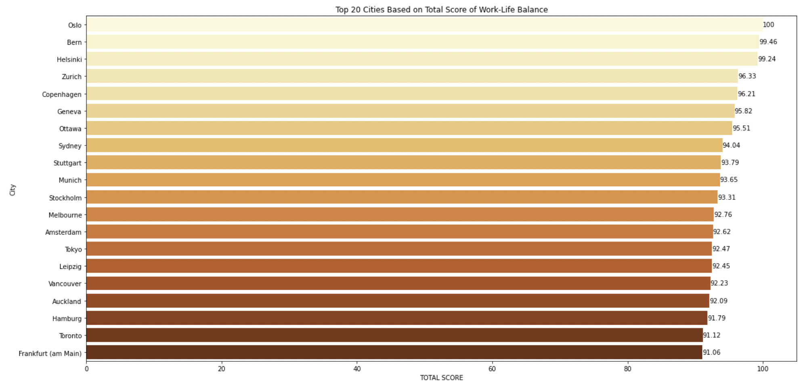
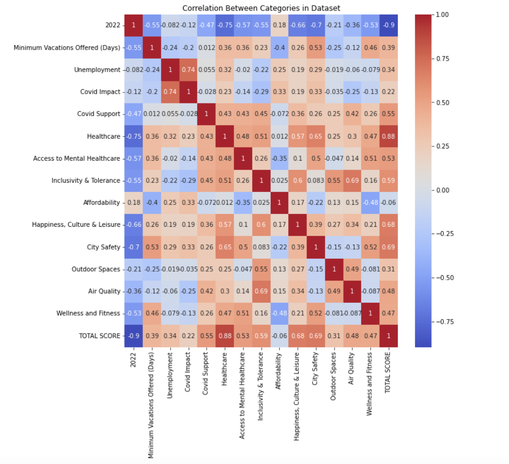
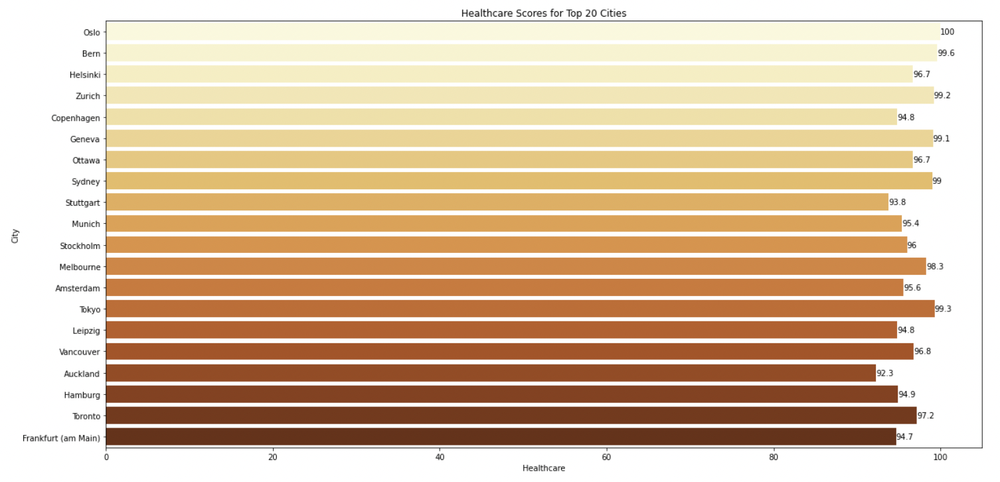
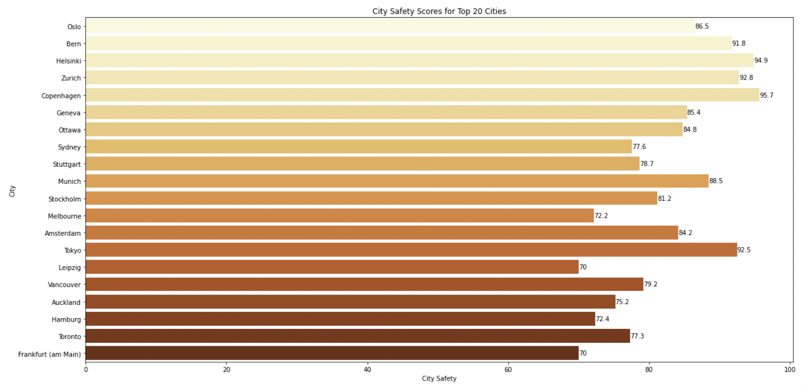
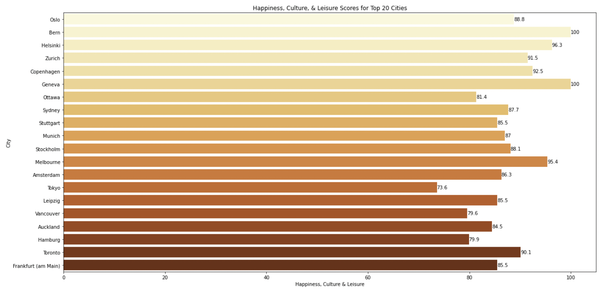

## Examining The Humanity Behind Work-Life Balance

#### By: Rohan Valia

# This project aims to use the dataset from Kaggle titled "Cities with the Best Work-Life Balance 2022" in order to explore which factors are most significant in the ranking of the top 20 cities with the highest total work-life balance score. The goal of this exploration is to determine what factors allow workers to improve performance and productivity and why they are important to workers as human beings.

#### Link to dataset: https://www.kaggle.com/datasets/prasertk/cities-with-the-best-worklife-balance-2022

## Part 1: Data Gathering


```python
# Import libraries 
import seaborn as sns
import matplotlib.pyplot as plt
import pandas as pd
```

### First, we import our dataset titled "Cities with the Best Work-Life Balance 2022."


```python
# Import dataset
df = pd.read_csv("Cities with the Best Work-Life Balance 2022.csv")
```


```python
# Check dataset
df
```


<div>
<style scoped>
    .dataframe tbody tr th:only-of-type {
        vertical-align: middle;
    }

    .dataframe tbody tr th {
        vertical-align: top;
    }

    .dataframe thead th {
        text-align: right;
    }
</style>
<table border="1" class="dataframe">
  <thead>
    <tr style="text-align: right;">
      <th></th>
      <th>2022</th>
      <th>2021</th>
      <th>City</th>
      <th>Country</th>
      <th>Remote Jobs</th>
      <th>Overworked Population</th>
      <th>Minimum Vacations Offered (Days)</th>
      <th>Vacations Taken (Days)</th>
      <th>Unemployment</th>
      <th>Multiple Jobholders</th>
      <th>...</th>
      <th>Healthcare</th>
      <th>Access to Mental Healthcare</th>
      <th>Inclusivity &amp; Tolerance</th>
      <th>Affordability</th>
      <th>Happiness, Culture &amp; Leisure</th>
      <th>City Safety</th>
      <th>Outdoor Spaces</th>
      <th>Air Quality</th>
      <th>Wellness and Fitness</th>
      <th>TOTAL SCORE</th>
    </tr>
  </thead>
  <tbody>
    <tr>
      <th>0</th>
      <td>1</td>
      <td>2</td>
      <td>Oslo</td>
      <td>Norway</td>
      <td>41.72%</td>
      <td>11.20%</td>
      <td>25</td>
      <td>25</td>
      <td>94.7</td>
      <td>9.10%</td>
      <td>...</td>
      <td>100.0</td>
      <td>85.0</td>
      <td>93.2</td>
      <td>59.4</td>
      <td>88.8</td>
      <td>86.5</td>
      <td>95.6</td>
      <td>97.5</td>
      <td>65.7</td>
      <td>100.00</td>
    </tr>
    <tr>
      <th>1</th>
      <td>2</td>
      <td>-</td>
      <td>Bern</td>
      <td>Switzerland</td>
      <td>44.86%</td>
      <td>11.40%</td>
      <td>20</td>
      <td>25</td>
      <td>99.8</td>
      <td>7.60%</td>
      <td>...</td>
      <td>99.6</td>
      <td>78.6</td>
      <td>94.6</td>
      <td>69.9</td>
      <td>100.0</td>
      <td>91.8</td>
      <td>87.1</td>
      <td>100.0</td>
      <td>69.1</td>
      <td>99.46</td>
    </tr>
    <tr>
      <th>2</th>
      <td>3</td>
      <td>1</td>
      <td>Helsinki</td>
      <td>Finland</td>
      <td>38.92%</td>
      <td>12.70%</td>
      <td>25</td>
      <td>30</td>
      <td>89.3</td>
      <td>6.30%</td>
      <td>...</td>
      <td>96.7</td>
      <td>73.0</td>
      <td>93.9</td>
      <td>65.0</td>
      <td>96.3</td>
      <td>94.9</td>
      <td>86.0</td>
      <td>97.0</td>
      <td>68.3</td>
      <td>99.24</td>
    </tr>
    <tr>
      <th>3</th>
      <td>4</td>
      <td>3</td>
      <td>Zurich</td>
      <td>Switzerland</td>
      <td>44.86%</td>
      <td>11.90%</td>
      <td>20</td>
      <td>25</td>
      <td>99.2</td>
      <td>7.60%</td>
      <td>...</td>
      <td>99.2</td>
      <td>78.6</td>
      <td>87.5</td>
      <td>71.6</td>
      <td>91.5</td>
      <td>92.8</td>
      <td>84.0</td>
      <td>96.2</td>
      <td>68.7</td>
      <td>96.33</td>
    </tr>
    <tr>
      <th>4</th>
      <td>5</td>
      <td>5</td>
      <td>Copenhagen</td>
      <td>Denmark</td>
      <td>41.42%</td>
      <td>10.50%</td>
      <td>25</td>
      <td>28</td>
      <td>94.8</td>
      <td>7.60%</td>
      <td>...</td>
      <td>94.8</td>
      <td>77.6</td>
      <td>95.2</td>
      <td>65.3</td>
      <td>92.5</td>
      <td>95.7</td>
      <td>75.5</td>
      <td>95.1</td>
      <td>66.3</td>
      <td>96.21</td>
    </tr>
    <tr>
      <th>...</th>
      <td>...</td>
      <td>...</td>
      <td>...</td>
      <td>...</td>
      <td>...</td>
      <td>...</td>
      <td>...</td>
      <td>...</td>
      <td>...</td>
      <td>...</td>
      <td>...</td>
      <td>...</td>
      <td>...</td>
      <td>...</td>
      <td>...</td>
      <td>...</td>
      <td>...</td>
      <td>...</td>
      <td>...</td>
      <td>...</td>
      <td>...</td>
    </tr>
    <tr>
      <th>95</th>
      <td>96</td>
      <td>49</td>
      <td>Bangkok</td>
      <td>Thailand</td>
      <td>16.84%</td>
      <td>15.10%</td>
      <td>6</td>
      <td>10</td>
      <td>99.2</td>
      <td>3.70%</td>
      <td>...</td>
      <td>75.7</td>
      <td>79.7</td>
      <td>73.5</td>
      <td>50.0</td>
      <td>65.8</td>
      <td>27.8</td>
      <td>70.1</td>
      <td>84.0</td>
      <td>65.4</td>
      <td>70.73</td>
    </tr>
    <tr>
      <th>96</th>
      <td>97</td>
      <td>47</td>
      <td>Sao Paulo</td>
      <td>Brazil</td>
      <td>25.65%</td>
      <td>11.80%</td>
      <td>10</td>
      <td>30</td>
      <td>79.6</td>
      <td>4.70%</td>
      <td>...</td>
      <td>62.5</td>
      <td>50.0</td>
      <td>79.5</td>
      <td>55.5</td>
      <td>75.8</td>
      <td>17.4</td>
      <td>76.9</td>
      <td>88.0</td>
      <td>61.9</td>
      <td>66.57</td>
    </tr>
    <tr>
      <th>97</th>
      <td>98</td>
      <td>50</td>
      <td>Kuala Lumpur</td>
      <td>Malaysia</td>
      <td>30.70%</td>
      <td>17.10%</td>
      <td>8</td>
      <td>12</td>
      <td>94.9</td>
      <td>1.10%</td>
      <td>...</td>
      <td>66.7</td>
      <td>74.3</td>
      <td>57.0</td>
      <td>70.5</td>
      <td>59.5</td>
      <td>47.2</td>
      <td>62.2</td>
      <td>84.8</td>
      <td>59.7</td>
      <td>66.02</td>
    </tr>
    <tr>
      <th>98</th>
      <td>99</td>
      <td>-</td>
      <td>Dubai</td>
      <td>UAE</td>
      <td>28.89%</td>
      <td>23.40%</td>
      <td>30</td>
      <td>27</td>
      <td>100.0</td>
      <td>10.00%</td>
      <td>...</td>
      <td>69.4</td>
      <td>52.2</td>
      <td>50.0</td>
      <td>78.0</td>
      <td>79.2</td>
      <td>97.9</td>
      <td>50.0</td>
      <td>50.0</td>
      <td>58.6</td>
      <td>61.23</td>
    </tr>
    <tr>
      <th>99</th>
      <td>100</td>
      <td>-</td>
      <td>Cape Town</td>
      <td>South Africa</td>
      <td>26.06%</td>
      <td>14.80%</td>
      <td>15</td>
      <td>-</td>
      <td>50.0</td>
      <td>3.50%</td>
      <td>...</td>
      <td>50.0</td>
      <td>65.0</td>
      <td>89.7</td>
      <td>71.6</td>
      <td>59.6</td>
      <td>1.0</td>
      <td>87.6</td>
      <td>94.5</td>
      <td>50.0</td>
      <td>50.00</td>
    </tr>
  </tbody>
</table>
<p>100 rows × 24 columns</p>
</div>


#### The dataset above ranks 100 global cities and ranks each city on their work-life balance based on various numerical ratings. Each city is rated on about 20 difference factors in regards to work-life balance, and based on the accumulation of these ratings, each country is given a total score of their work-life balance. 
#### The study was conducted by Kisi, who sourced the data from various international organizations and reports, open datasets, public surveys, and crowdsourcing. In their data collection, the study was divided into three categories: work intensity, society and institutions, and city liveability. Within work intensity, some categories include the percentage of overworked population, as well as the minimum number of vacation days offered. Within society and institutions, categories such as healthcare, as well as inclusivity and tolerance were scored and rated using different formulas and aggregations. Within city liveability, categories included happiness, culture, and leisure, as well as city safety, and were also given numerical ratings to determine their level.

## Part 2: Data Visualization

### To analyze our dataset, we first determine the top 20 cities with highest work-life balance based on total score.


```python
# Establish figure size and title
plt.figure(figsize=(20,10))
plt.title("Top 20 Cities Based on Total Score of Work-Life Balance")
# Plot bar graph total score for top 20 cities
ax = sns.barplot(data=df.head(20), x="TOTAL SCORE", y="City", palette="YlOrBr")
# Add bar label of each city's score
for i in ax.containers:
    ax.bar_label(i,)
```


    

    


#### From the graph above, we can see the highest ranked city for work-life balance based on total score is Oslo (Norway),  followed by Bern (99.46), Helsinki (99.24), Zurich (96.33), and Copenhagen (96.21). 

### Next, we find the correlation between each category to find which categories are most correlated to total score.


```python
# Establishes correlation between variables in dataset
corr = df.corr()
# Set figure size
plt.figure(figsize=(10,10))
plt.title("Correlation Between Categories in Dataset")
# Plot heatmap of columns to find correlation between variables
sns.heatmap(corr, annot=True, cmap='coolwarm')
```



    

    


#### Using the heatmap above, we are able to view the correlation coefficient between each category in the dataset. The correlation coefficient determines the strength of the association between two variables on a scale of -1 to 1, where -1 shows a negative association between the variables (as one variable increases, the other decreases), 1 shows a positive association (both variables increase and decrease simulatenously), and 0 shows no association.

#### Looking at the correlation coefficient for each category in correspondence with the total score, we can see that Healthcare has the highest correlation (0.88), followed by City Safety (0.69) and Happiness, Culture & Leisure (0.68), showing a strong, positive association with total score. Conversely, affordability had the lowest correlation to total score (-0.06), showing a weak negative association with total score. The rest of the categories experienced a correlation between 0.30 and 0.60, showing a moderately positive association between the categories and total score.

#### Based on these results, we can further evaluate the correlation of the top three categories to the ranking of the top 20 cities work-life balance in order to confirm or neglect their impactfulness on human workers. 

### First, we look at the category with the highest correlation to total score: Healthcare.


```python
# Displays the healthcare scores for the top 20 cities (highest correlation category)

# Establish figure size and title
plt.figure(figsize=(20,10))
plt.title("Healthcare Scores for Top 20 Cities")
# Plot bar graph
ax = sns.barplot(data=df.head(20), x="Healthcare", y="City", palette="YlOrBr")
# Add bar label of each city's score
for i in ax.containers:
    ax.bar_label(i,)
```


    

    


#### Based on the graph above, among the top 20 ranked cities for work-life balance, Oslo has the highest Healthcare score (100), followed by Bern (99.6), Tokyo (99.3), Zurich (99.2), and Geneva (99.1). 
#### Within the top 6 ranked cities for total score for work-life balance, 4 are in the top 5 of highest Healthcare scores. In addition, Oslo, which had the overall highest total score, had the highest Healthcare score. Therefore, based on the correlation coeefficient between these two variables (0.88), this data confirms the strong positive association between Healthcare score and total score of work-life balance.

### Next, we look at the category with the second highest correlation to total score: City Safety.


```python
# Displays the city safety score for the top 20 cities (2nd highest correlation category)

# Establish figure size and title
plt.figure(figsize=(20,10))
plt.title("City Safety Scores for Top 20 Cities")
# Plot bar graph
ax = sns.barplot(data=df.head(20), x="City Safety", y="City", palette="YlOrBr")
# Add bar label of each city's score
for i in ax.containers:
    ax.bar_label(i,)
```


    

    


#### Based on the graph above, among the top 20 cities, Copenhagen has the highest City Safety score (95.7), followed by Helsinki (94.9), Zurich (92.8), Amsterdam (92.5), and Bern (91.8). 

#### Within the top 5 cities for work-life balance based on total score, 4 are in the top 5 for highest City Safety score. In addition, the graph displays the generally trend that the City Safety score is higher for the top ranked cities for work-life balance and becomes lower as the rank of cities decreases. Therefore, based on the correlation coeefficient between these two variables (0.69), this data confirms the positive association between the City Safety score and the total score of work-life balance.

### Last, we look at the category with the third highest correlation to total score: Happiness, Culture, & Leisure.


```python
# Displays the happiness, culture & leisure score for the top 20 cities (3rd highest correlation category)

# Establish figure size and title
plt.figure(figsize=(20,10))
plt.title("Happiness, Culture, & Leisure Scores for Top 20 Cities")
# Plot bar graph
ax = sns.barplot(data=df.head(20), x="Happiness, Culture & Leisure", y="City", palette="YlOrBr")
# Add bar label of each city's score
for i in ax.containers:
    ax.bar_label(i,)
```



    


#### Based on the graph above, among the top 20 cities, Bern and Geneva have the highest Happiness, Culture, & Leisure score (100), followed by Helsinki (96.3), Stockholm (95.4), Copenhagen (92.5), and Zurich (91.5).

#### Within the top 6 cities for work-life balance, 5 are in the top 6 of highest Happiness, Culture, & Leisure scores. In addition, through the graph, we can see the general positive association between the total score and Happiness, Culture, & Leisure scores, as the highest scores tend to be for the cities at the top graph, and the scores generally decrease in progression down the graph. Therefore, based on the correlation coeefficient between these two variables (0.68), this data confirms the positive association between Happiness, Culture, & Leisure and total score of work-life balance.

## Part 3: Discussion and Analysis

#### After examining this dataset, we now have a better understanding of which factors influence the work-life balance of workers more strongly than others, as seen through the correlation between certain factors and the ratings of work-life balance in global cities. 
#### To further our understanding and conceptualize these findings, we will analyze why these factors are important to the work-life balance and productivity of workers and how they impact the well-being and health of workers as humans.

#### From the heatmap created to show the correlation between the categories and total score of work-life balance, we determined that the top 3 categories in terms of highest correlation coefficient were Healthcare, City Safety, and Happiness, Culture, & Leisure. As we saw from plotting graphs of these categories for the top 20 ranked cities for work-life balance, there was a clear positive association where the top ranked cities generally had the highest scores for these categories. A commonality that can drawn between these three categories is their link to physical and mental health. According to the National Library of Medicine, "employees who are in good physical, mental, and emotional health are more likely to deliver optimal performance in the workplace than employees who are not" (Adams). In addition, according to the CDC, mental health can directly affect "job performance and productivity" and "physical capability and daily functioning." Therefore, it is evident that physical and mental health are both instrumental to quality of life and the stability of workers as human beings, which directly impacts worker productivity and their work-life balance. 
#### In regards to the top two categories (Healthcare and City Safety), by having higher access to healthcare and safer environments to work, human workers are inherently going to experience increased levels of physical security and safety, which would have direct impact on their physical and mental health. In confirmation of this concept, the National Library of Medicine writes that physical security "is a prerequisite for a peaceable, constructive and collective existence in which individuals have the best chance to live in a state of complete physical, mental and social well-being" (Coupland). Based on this notion, workers who inherently and subconciosuly feel they are physically secure are able to experience higher levels of physical and mental health, which in turn would boost the overall well-being of humans, and ultimately their productivity in the workplace. 
#### In regards to the third highest category (Happiness, Culture & Leisure), by having increased levels of happiness and opportunities for leisure, human workers are inherently able to experience higher levels of mental health that would provide for a positive work-life balance. According to the National Library of Medicine, "healthy and happy employees have a better quality of life," "a lower risk of disease and injury," and increased work productivity" (Adams). Furthermore, according to a study conducted by the National Library of Medicine regarding the impacts of leisure on the well-being for employees, their results confirmed the "positive benefits of weekend activities," "the role of recovery experiences in the relationship between weekend activities and job stress," and the "strengthening the effect of weekend activities on psychological well-being" (Jeong et al.). Based on this information, workers who experience high levels of happiness and leisure have inherently higher mental and physical health, which ultimately creates a more positive work-life balance.

## Part 4: Conclusion

#### To conclude, this project has demonstrated the importance that certain factors surrounding work-life balance  that influence the working conditions, quality of life, and health of workers that impact their ability to function as humans and ultimately perform in the workplace. By unpacking the dataset by Kaggle titled  "Cities with the Best Work-Life Balance 2022," we were able to analyze the impact of a variety of categories regarding work intensity, society and institutions, and city liveability on work-life balance. The exploration and analysis of this dataset throughout this project allowed us to determine that the most significant factors corresponded to the health, safety, and happiness of workers, furthering our understanding of the concept that increased physical and mental health leads to a more positive work-life balance for workers, showing the need and importance of treating workers as humans. This idea urges businesses and companies to prioritize the humanity of their workers, as the health and well-being of workers have direct implications on the productivity and performance in the workplace. Based on this data and analysis, corporate policies promoting increased work-life balance and leisure opportunties would enable workers to experience heightened mental and physical stability that would ultimately encourage higher productivity within the workplace. Furthermore, workers should actively pursue a healthy work-life balance on their own and prioritize their mental and physical health by engaging in extracurricular activities, and expanding their social network outisde of the workplace, for example, as a part of the emphasis on humanity for workers.

## Works Cited

#### Adams, Jerome M. “The Value of Worker Well-Being - PMC.” NCBI, 10 October 2019, https://www.ncbi.nlm.nih.gov/pmc/articles/PMC6832080/. Accessed 19 December 2022.
#### “Cities with the Best Work-Life Balance 2022.” Kaggle, https://www.kaggle.com/datasets/prasertk/cities-with-the-best-worklife-balance-2022. Accessed 19 December 2022.
#### Coupland, Robin. “Security, insecurity and health - PMC.” NCBI, 4 December 2006, https://www.ncbi.nlm.nih.gov/pmc/articles/PMC2636224/#R1. Accessed 19 December 2022.
#### Jeong, Jae-Geum, et al. “Employees' Weekend Activities and Psychological Well-Being via Job Stress: A Moderated Mediation Role of Recovery Experience.” NCBI, 3 March 2020, https://www.ncbi.nlm.nih.gov/pmc/articles/PMC7084709/. Accessed 19 December 2022.
#### “Mental Health in the Workplace.” CDC, 10 April 2019, https://www.cdc.gov/workplacehealthpromotion/tools-resources/workplace-health/mental-health/index.html. Accessed 19 December 2022.
#### “Work-Life Balance: Best Cities Worldwide in 2022.” Kisi, https://www.getkisi.com/work-life-balance-2022#table. Accessed 19 December 2022.
